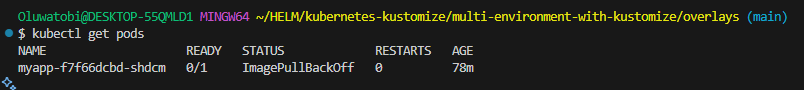
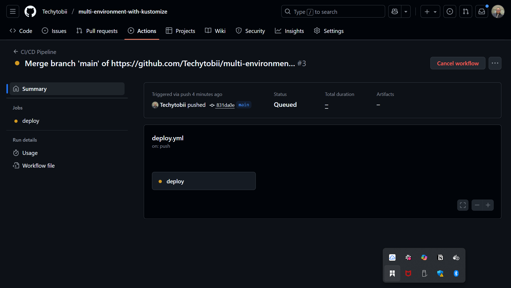
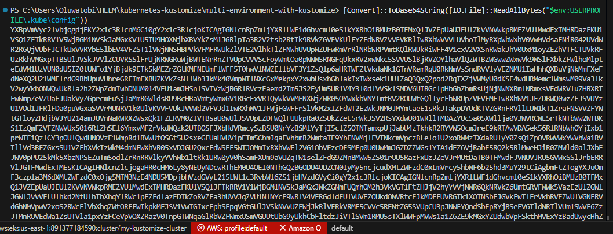
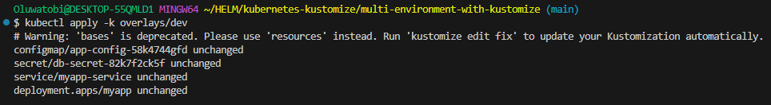
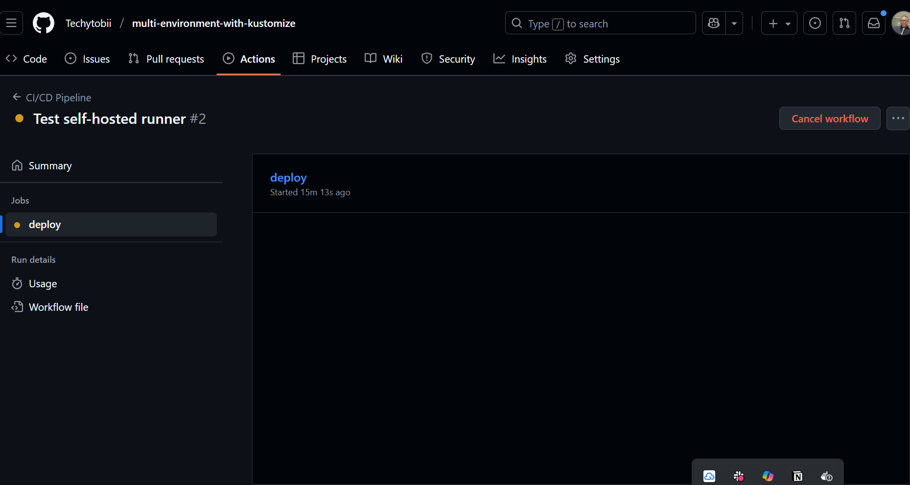

# Implementing a Multi-Environment Application Deployment with Kustomize

## 📌 Hypothetical Use Case
You are tasked with deploying a **web application** in a Kubernetes environment.  
The application requires different configurations for **development, staging, and production** environments.  

Your goal is to:
- Utilize **Kustomize** to manage these configurations efficiently.  
- Integrate the process into a **CI/CD pipeline** for automated deployments.  

---

## 🎯 Project Objectives
- Implement Kubernetes **base manifests** for the application.  
- Create **overlays** for development, staging, and production.  
- Manage **Secrets and ConfigMaps** securely.  
- Implement **CI/CD pipeline integration**.  
- Explore **advanced Kustomize features** (Transformers & Generators).  

---

## 📂 Project Structure
```bash
kustomize-multi-env/
│── base/
│   ├── deployment.yaml
│   ├── service.yaml
│   └── kustomization.yaml
│
│── overlays/
│   ├── dev/
│   │   └── kustomization.yaml
│   ├── staging/
│   │   └── kustomization.yaml
│   └── prod/
│       └── kustomization.yaml
│
│── .github/
│   └── workflows/
│       └── deploy.yml
│
└── .env.secret   # Not committed (used for secret generation)
```

## ✅ Tasks Breakdown

### 🔒 Secrets & Config Management
Secrets are excluded from Git using .gitignore.

* .env.secret file (local only):
```
env
Copy
Edit
DB_USERNAME=admin
DB_PASSWORD=SuperSecretPass123
```

### 📄 .gitignore
This ensures sensitive files and unnecessary clutter are not pushed to GitHub.

* .gitignore
```
gitignore

# Ignore secret files
.env.secret
*.key
*.pem

# Ignore IDE/editor settings
.vscode/
.idea/
*.swp

# Ignore Kubernetes/Helm/Kustomize generated files
*.log
*.tmp
*.out
*.bak

# Ignore system files
.DS_Store
Thumbs.db

# Ignore node_modules or vendor if app code exists here
node_modules/
vendor/
```

### ⚙️ GitHub Actions Workflow (CI/CD)
A GitHub Actions pipeline was set up in .github/workflows/deploy.yml.
It applies different Kustomize overlays based on the branch:

* .github/workflows/deploy.yml
```
name: Deploy to Kubernetes

on:
  push:
    branches:
      - dev
      - staging
      - main

jobs:
  deploy:
    runs-on: ubuntu-latest
    steps:
      - name: Checkout repository
        uses: actions/checkout@v2

      - name: Set up kubectl
        uses: azure/setup-kubectl@v3
        with:
          version: 'latest'

      - name: Deploy Dev
        if: github.ref == 'refs/heads/dev'
        run: kubectl apply -k overlays/dev

      - name: Deploy Staging
        if: github.ref == 'refs/heads/staging'
        run: kubectl apply -k overlays/staging

      - name: Deploy Production
        if: github.ref == 'refs/heads/main'
        run: kubectl apply -k overlays/prod
```

### 📌 How it works:

* Pushing to dev → deploys overlays/dev

* Pushing to staging → deploys overlays/staging

* Pushing to main → deploys overlays/prod

### 📸 Screenshots / Evidence

✅ Output of kubectl get pods

* 

✅ CI/CD pipeline run in GitHub Actions

* 

✅ Proof of ConfigMap & Secret created

* 

* 

✅ Application running in Dev/Staging/Prod

* 

### 📝 Challenges Faced
* Managing Secrets securely without committing them.

* Config drift across environments.

* Debugging hash changes for ConfigMaps/Secrets.

* Integrating GitHub Actions with Kubernetes.

### ✅ Objectives Achieved
Multi-environment Kubernetes deployment with Kustomize overlays.

Secure handling of Secrets & ConfigMaps.

Automated CI/CD workflow with GitHub Actions.

Documentation and implementation of advanced Kustomize features.

### 📎 GitHub Repository
* GitHub Repo https://github.com/Techytobii/multi-environment-with-kustomize.git